 

`$100K SCF Grant`&nbsp;&nbsp;·&nbsp;&nbsp;`IIIT Guwahati — CGPA 9.10`&nbsp;&nbsp;·&nbsp;&nbsp;`ex-JPMorgan`&nbsp;&nbsp;·&nbsp;&nbsp;`Mainnet Shipped`&nbsp;&nbsp;·&nbsp;&nbsp;`Open Campus Incubation`

 

---

<table>
<tr>
<td width="68%" valign="top">

### Profile

Founder-engineer. I take ideas from a **blank page to production mainnet**, fast, across ecosystems I had never touched the week before.

**PayZoll** &nbsp;·&nbsp; Co-founder and lead architect. Won the **$100K Stellar Community Fund** grant, then shipped to **Soroban mainnet in ~4 months**. Built the full Rust service: message queues, payment delegation, recoverability, real-time health dashboard.

**JP Morgan** &nbsp;·&nbsp; Asset & Wealth Management. Shipped a RAG ticket-triage pipeline (bug resolution **~1 week → ~1 day**) and a Snowflake pipeline that cut manual reporting **60%+**.

**Five protocols shipped** across Stellar, Mantle, Polkadot and Base: payments, privacy, on-chain credit, RWA, climate-data trust.

**IIIT Guwahati** &nbsp;·&nbsp; B.Tech Computer Science, CGPA **9.10 / 10**, graduating July 2026.

Signature move: learning by building under live pressure. Hackathon to mainnet.

</td>
<td width="32%" valign="top" align="center">

Web3 · Privacy · AI Infra

</td>
</tr>
</table>

---

## Featured Work

<table>
<tr>
<td width="50%" valign="top">

#### 01 · [PayZoll](https://payzoll.in) &nbsp;Stellar
Cross-border payroll and treasury, built for crypto-native teams.

   

`Mainnet Live` · `Build Better — 1st` · `$100K SCF Grant`

</td>
<td width="50%" valign="top">

#### 02 · [OpenAssets](https://www.openassets.xyz) &nbsp;Mantle
The Mantle-native gateway bridging the RWA liquidity gap.

   

`ERC-3643 T-REX` · `mETH` · `VietBuidl + Mantle wins`

</td>
</tr>
<tr>
<td width="50%" valign="top">

#### 03 · [Tesseract](https://tesseractprotocol.xyz) &nbsp;Stellar · Soroban
Privacy-preserving payment and identity mixing on Stellar.

   

`SDP + Privacy` · `Channel Accounts` · `Temporal Decorrelation`

</td>
<td width="50%" valign="top">

#### 04 · [Kredio](https://kredio-gamma.vercel.app) &nbsp;Polkadot · Paseo
DeFi with memory. Polkadot's on-chain credit layer.

  

`Asset Hub` · `NeuralScorer AI` · `YieldMind Engine`

</td>
</tr>
<tr>
<td width="50%" valign="top">

#### 05 · [Clear Sky](https://docs.clearsky.network) &nbsp;Base · Story Protocol
The trust layer for climate data. DePIN meets verifiable IP.

   

`ECDSA` · `Story Protocol` · `Phase 1 Foundation`

</td>
<td width="50%" valign="top">

#### In progress
**Agentic Treasury** — privacy-pool architecture for the Stellar Disbursement Platform (Noir, BN-254, Poseidon).

 

</td>
</tr>
</table>

---

## Stack

<b>WEB3</b>

<b>BACKEND &amp; INFRA</b>

<b>AI / ML</b>

<b>FRONTEND</b>

---

## GitHub Activity

<picture>
  <source media="(prefers-color-scheme: dark)" srcset="https://raw.githubusercontent.com/18Abhinav07/18Abhinav07/output/github-contribution-grid-snake-dark.svg" />
  <source media="(prefers-color-scheme: light)" srcset="https://raw.githubusercontent.com/18Abhinav07/18Abhinav07/output/github-contribution-grid-snake.svg" />
  
</picture>

---

## Certifications

<b>All certificates &nbsp;·&nbsp; Coursera · DeepLearning.AI · Harvard CS50 · Google</b>

 

| | |
|---|---|
| [Deep Learning Specialization](Certificates/Deep_Learning_specialization.pdf) | [Machine Learning Specialization](Certificates/Machine_Larning_Specialisation.pdf) |
| [TensorFlow Developer](Certificates/TF_developer.pdf) | [Generative AI](Certificates/Generative_AI.pdf) |
| [Neural Networks & Deep Learning](Certificates/Neural_Networks_and_Deep_Learning.pdf) | [Convolutional Neural Networks](Certificates/CNN.pdf) |
| [Sequence Models](Certificates/Sequence_models.pdf) | [NLP with TensorFlow](Certificates/NLP_TF.pdf) |
| [Supervised ML](Certificates/Supervised_ML.pdf) | [Unsupervised Learning](Certificates/Unsupervised_Learning.pdf) |
| [Advanced Learning Algorithms](Certificates/Advanced_Learning_Algorithm.pdf) | [Hyperparameter Tuning](Certificates/Improving_Hyperparameters.pdf) |
| [Structuring ML Projects](Certificates/Structuring_ML_Project.pdf) | [CS50 · AI with Python](Certificates/CS50AI.pdf) |
| [CS50 · Python](Certificates/CS50P.pdf) | [CS50 · Web](Certificates/CS50WEB.pdf) |
| [CS50 · SQL](Certificates/CS50_SQL.pdf) | [CS50 · Cybersecurity](Certificates/CS50Cybersecurity.pdf) |
| [Google Data Analytics](Certificates/Data_Analytics.pdf) | [Full-Stack Development](Certificates/FullStack.pdf) |
| [Django](Certificates/Django.pdf) | [JavaScript](Certificates/Javascript.pdf) |
| [API Development](Certificates/API.pdf) | [R Programming](Certificates/R_programming.pdf) |

---

### Building something ambitious? Let's talk.

