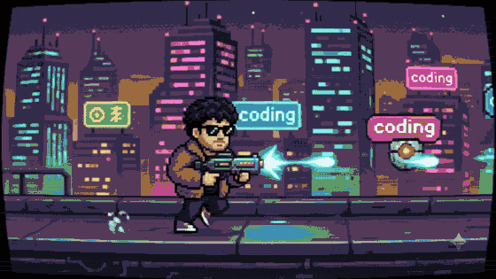

 

`$100K Stellar SCF Grant`&nbsp;&nbsp;·&nbsp;&nbsp;`IIIT Guwahati (CGPA 9.10)`&nbsp;&nbsp;·&nbsp;&nbsp;`ex-JPMorgan`&nbsp;&nbsp;·&nbsp;&nbsp;`Mainnet Shipped`&nbsp;&nbsp;·&nbsp;&nbsp;`Open Campus Incubation`

 

---

### Profile

Founder & systems architect. I build production-grade infrastructure from a blank page to mainnet across protocols, agent execution layers, and distributed systems.

- **PayZoll** · Co-founder & lead architect. Won the **$100K Stellar Community Fund (SCF)** grant and shipped to **Soroban mainnet in ~4 months**. Engineered the core Rust/Go settlement services, multi-hop path payment formation, recovery queues, and operational dashboards.
- **AgentOps** · Designed the real-time policy firewall & spending control plane for autonomous AI agents across **Casper Network** and **Arc**, with atomic budget holds and immutable on-chain audit proof via Odra/Rust.
- **Guardian Kane** · Architected a 12-phase automated verification loop and code/PRD graph control plane for Claude Code, enforcing deterministic verification gates before agent tasks reach done.
- **JP Morgan** · Asset & Wealth Management. Shipped a RAG ticket-triage pipeline (reducing resolution cycle times from **~1 week to ~1 day**) and automated data pipelines cutting manual reporting by **60%+**.
- **IIIT Guwahati** · B.Tech Computer Science & Engineering (CGPA **9.10 / 10**).

---

## Featured Systems & Architecture

<table>
<tr>
<td width="50%" valign="top">

#### 01 · [AgentOps](https://github.com/AgenticOperations/AOPS-PMOA) &nbsp;Casper Network · Arc
Policy firewall and governance layer for autonomous AI agents across Casper and Arc. Real-time spend caps, velocity limits, and atomic budget holds anchored immutably to Casper GuardRegistry.

    

[Live App](https://agentops.up.railway.app) · [GitHub](https://github.com/AgenticOperations/AOPS-PMOA) · [Video Demo](https://www.youtube.com/watch?v=eulHWqBkedQ) · [Docs](https://aops.tiiny.site) · [Deck](https://canva.link/ja7l3zsexb11suy)

</td>
<td width="50%" valign="top">

#### 02 · [Guardian Kane](https://github.com/18Abhinav07/adventures-with-kane) &nbsp;Claude Code Tooling
12-phase automated verification loop and task control plane for Claude Code. Drives real browser tests, defect sweeps, PRD drift tracking, and code graph introspection.

   

[GitHub Repo](https://github.com/18Abhinav07/adventures-with-kane) · [Full System Demo (YouTube)](https://www.youtube.com/watch?v=TfVm0yNzBJE) · [Deep Dive Video](https://www.youtube.com/watch?v=efTl_ZSmXUw)

</td>
</tr>
<tr>
<td width="50%" valign="top">

#### 03 · [PayZoll](https://payzoll.in) &nbsp;Stellar · Soroban
Cross-border payroll and treasury infrastructure for crypto-native organizations. Multi-hop path payments and single-click mass settlement.

   

`$100K SCF Grant` · `Mainnet Live` · [payzoll.in](https://payzoll.in) · [Hackathon Demo (YouTube)](https://www.youtube.com/watch?v=yv8EjbytD2A)

</td>
<td width="50%" valign="top">

#### 04 · [VEIL / Tesseract](https://tesseractprotocol.xyz) &nbsp;Stellar
Privacy as a wallet and protocol primitive. Shielded note pool, private peer-to-peer transfers, batch payouts, and private prediction markets on Stellar.

  

`Shielded Note Model` · `Encrypted Vault` · [Protocol Live](https://tesseractprotocol.xyz) · [GitHub Org](https://github.com/The-Tesseract-Protocol) · [Video Demo](https://www.youtube.com/watch?v=CIWCdmyTbRY)

</td>
</tr>
<tr>
<td width="50%" valign="top">

#### 05 · [OpenAssets](https://www.openassets.xyz) &nbsp;Mantle Network
Institutional Real-World Asset (RWA) execution gateway bridging off-chain cash flows with on-chain liquidity via compliant security token standards.

   

[Live App](https://www.openassets.xyz) · [GitHub](https://github.com/TheOpenAssets) · [Video Demo (YouTube)](https://www.youtube.com/watch?v=RYDPzdRAqPg) · [Deck](https://canva.link/tbjsx34kgdzju4c)

</td>
<td width="50%" valign="top">

#### 06 · [Kredio](https://kredio-gamma.vercel.app) &nbsp;Polkadot · Paseo
Decentralized on-chain credit scoring and risk evaluation layer. Hybrid EVM ↔ PolkaVM atomic execution with cross-chain scoring via XCM.

  

[Live App](https://kredio-gamma.vercel.app) · [GitHub](https://github.com/18Abhinav07/Kredio) · [Video Walkthrough (YouTube)](https://www.youtube.com/watch?v=zNR5cX0gdCA)

</td>
</tr>
</table>

  

---

## Technical Stack

<b>SYSTEMS &amp; SMART CONTRACTS</b> 

&nbsp;

  

<b>AGENTIC AI &amp; INFRASTRUCTURE</b> 

&nbsp;

  

<b>BACKEND &amp; CLOUD PLATFORMS</b> 

  

<b>FRONTEND &amp; INTERFACES</b> 

---

## Activity & Metrics

<picture>
  <source media="(prefers-color-scheme: dark)" srcset="https://raw.githubusercontent.com/18Abhinav07/18Abhinav07/output/github-contribution-grid-snake-dark.svg" />
  <source media="(prefers-color-scheme: light)" srcset="https://raw.githubusercontent.com/18Abhinav07/18Abhinav07/output/github-contribution-grid-snake.svg" />
  
</picture>

  

---

## Certifications

<b>View All Certificates &nbsp;·&nbsp; DeepLearning.AI · Harvard CS50 · Google · Coursera</b>

 

| | |
|---|---|
| [Deep Learning Specialization](Certificates/Deep_Learning_specialization.pdf) | [Machine Learning Specialization](Certificates/Machine_Larning_Specialisation.pdf) |
| [TensorFlow Developer](Certificates/TF_developer.pdf) | [Generative AI](Certificates/Generative_AI.pdf) |
| [Neural Networks & Deep Learning](Certificates/Neural_Networks_and_Deep_Learning.pdf) | [Convolutional Neural Networks](Certificates/CNN.pdf) |
| [Sequence Models](Certificates/Sequence_models.pdf) | [NLP with TensorFlow](Certificates/NLP_TF.pdf) |
| [Supervised ML](Certificates/Supervised_ML.pdf) | [Unsupervised Learning](Certificates/Unsupervised_Learning.pdf) |
| [Advanced Learning Algorithms](Certificates/Advanced_Learning_Algorithm.pdf) | [Hyperparameter Tuning](Certificates/Improving_Hyperparameters.pdf) |
| [Structuring ML Projects](Certificates/Structuring_ML_Project.pdf) | [CS50 · AI with Python](Certificates/CS50AI.pdf) |
| [CS50 · Python](Certificates/CS50P.pdf) | [CS50 · Web](Certificates/CS50WEB.pdf) |
| [CS50 · SQL](Certificates/CS50_SQL.pdf) | [CS50 · Cybersecurity](Certificates/CS50Cybersecurity.pdf) |
| [Google Data Analytics](Certificates/Data_Analytics.pdf) | [Full-Stack Development](Certificates/FullStack.pdf) |
| [Django](Certificates/Django.pdf) | [JavaScript](Certificates/Javascript.pdf) |
| [API Development](Certificates/API.pdf) | [R Programming](Certificates/R_programming.pdf) |

---

### Let's build something resilient.

